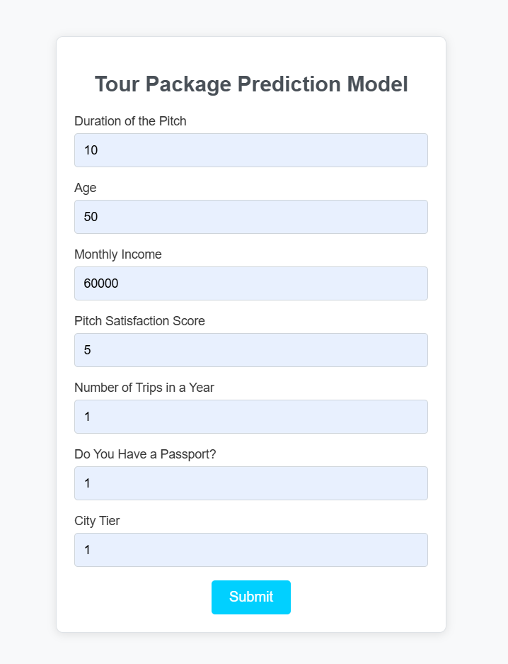
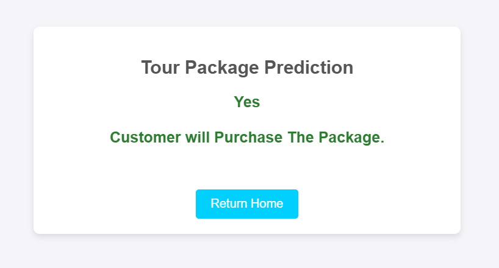

# 🚀 **Tour Package Prediction** 🌍

Welcome to the **Tour Package Prediction** project! This web application predicts the likelihood of a customer purchasing a tour package based on multiple inputs such as age, income, pitch satisfaction, and more. 

This project uses **Flask** for the web framework and **Machine Learning** with a pre-trained decision tree model to make predictions.


## 🔧 **Tech Stack**

- **Python**
- **Flask**: For web framework
- **NumPy**: For numerical operations
- **Pandas**: For data manipulation
- **Scikit-learn**: For machine learning models
- **Matplotlib**: For data visualization
- **Seaborn**: For statistical data visualization
- **Gunicorn**: For running the Flask application in production


## 📦 **Requirements**

To run this project, install the following Python libraries:

```bash
pip install -r requirements.txt
```

The `requirements.txt` includes:

- numpy
- pandas
- scikit-learn
- matplotlib
- seaborn
- flask
- gunicorn


## 🏠 **How to Run Locally**

1. **Clone the repository:**

   ```bash
   git clone https://github.com/prantikm07/Tour-Package-Prediction.git
   ```

2. **Navigate to the project directory:**

   ```bash
   cd Tour-Package-Prediction
   ```

3. **Install the dependencies:**

   ```bash
   pip install -r requirements.txt
   ```

4. **Run the application:**

   ```bash
   python app.py
   ```

5. Visit `http://127.0.0.1:5000/` in your browser to access the application.


## 🧑‍💻 **How it Works**

- The application allows users to input various features such as **Duration of Pitch**, **Age**, **Monthly Income**, **Pitch Satisfaction Score**, **Number of Trips**, **Passport Availability**, and **City Tier**.
- The pre-trained decision tree model predicts whether the user will likely purchase a tour package based on the input values.
- The result is displayed on the web page.


## 📸 **Screenshots**

1. **Home Page:**
   
   

2. **Prediction Result:**
   
   


## 🧑‍🤝‍🧑 **Contributing**

Feel free to fork this repository and submit pull requests if you'd like to contribute!


## 🔗 **Links**

- GitHub Repository: [Tour-Package-Prediction](https://github.com/prantikm07/Tour-Package-Prediction.git)
- Live Application: [Live Demo](https://tour-package-prediction.onrender.com)


## Contact

If you have any questions, feel free to contact me via:
- Email: [prantik25m@gmail.com](mailto:prantik25m@gmail.com)
- LinkedIn: [Prantik Mukhopadhyay](https://www.linkedin.com/in/prantikm07/)